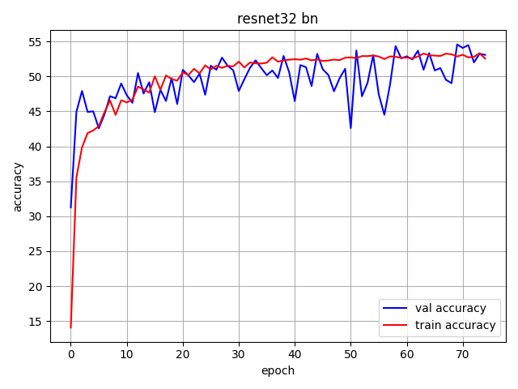
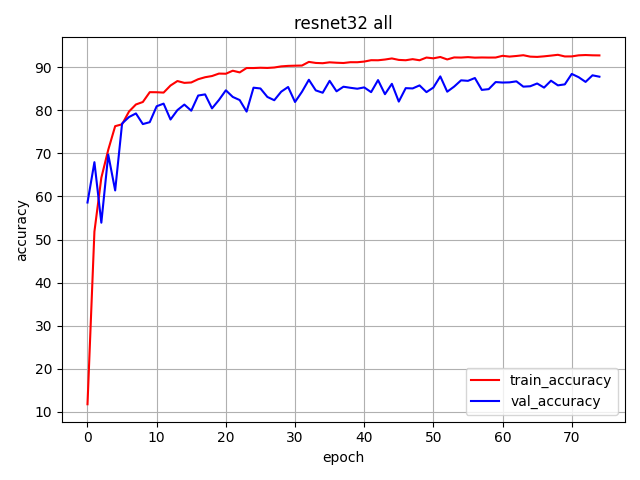
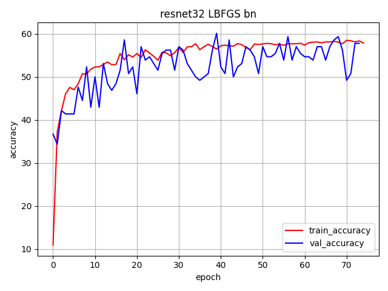
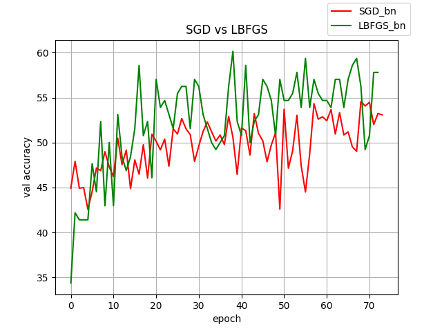
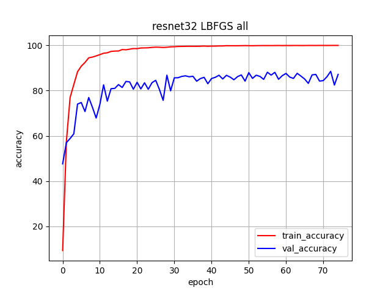
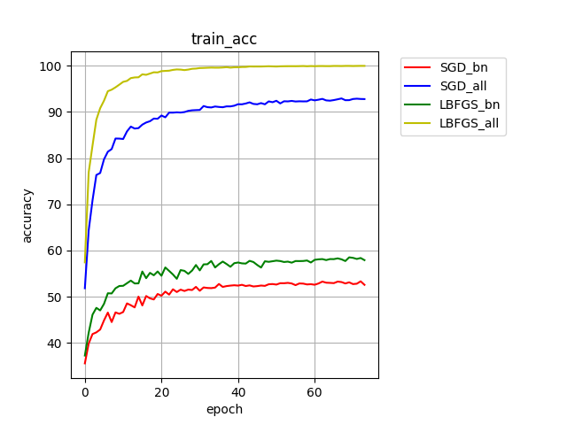
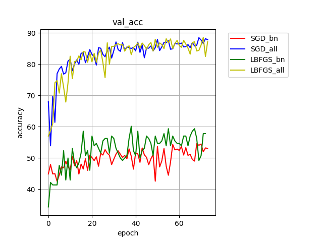
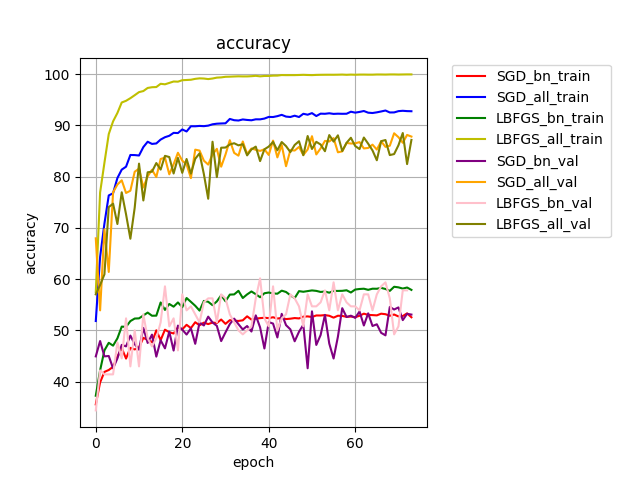

# Training Batchnorm And Only BatchNorm
Тестируем идею из https://arxiv.org/pdf/2003.00152.pdf

## Запуск кода
### установить зависимости
`install -r requirements.txt`
### обучение 
`python train.py -t <bn | all> --use-lbfgs <True| False >--save-dir <path/to/save> -j <num_workers>`
```
-t bn - обучаются только параметры batchnormalization, -t all - обучаются все параметры модели
--use-lbfgs True - вместо SGD будет использован LBFGS
 еще больше флагов в config.py
```

## Что получилось
Для простоты тестировался только resnet32 на датасете cifar10. 

### учились только BatchNormalization
 

Надо же, действительно учится. Bias большеват, надо бы добавить регуляризации или снизить learning rate. 

### учились все параметры
 

Видим, что модель переобучется, но у нас сейчас нет цели обучить отличный классификатор для cifar10, идем дальше

Первый эксмеримент показал, что идея рабочая. Посмотрим, сколько обучаемых параметров в обеих вариантах модельки:

`python resnet.py` 


*resnet 32, all layers trainable: Total number of params 464154*

*resnet 32, only BN layers trainable: Total number of params 2272*

Интересно попробовать обучить "замороженый" вариант сетки с LBFGS. По идее, он должен сходиться быстрее. Смотрим:
 

Работает, bias опять таки большеват. Сравним теперь метрики на тестовом датасете для SGD и LBFGS

 

LBFGS сходится быстрее. Но оба оптимизатора требуют регуляризации.

Для интереса поучим полную модельку с LBFGS
 

Оверфит как из учебника.


Больше интересных графиков:


  
 
 


## Выводы

Мы действительно можем обучать только batchnormalization и получить значимые результаты. 
В дальнейшем было бы интересно протестировать Adam и другие адаптационные алгоритмы или подобрать метапараметры для LBFGS.
Также интересно затестить другие доменные области, не только изображения.
Если найти максимально быстро сходящийся алгоритм, можно попробовать предобучать замороженные модели несколько эпох, 
и посмотреть, как это повлияет на дальнейшее обучение.
 


 
